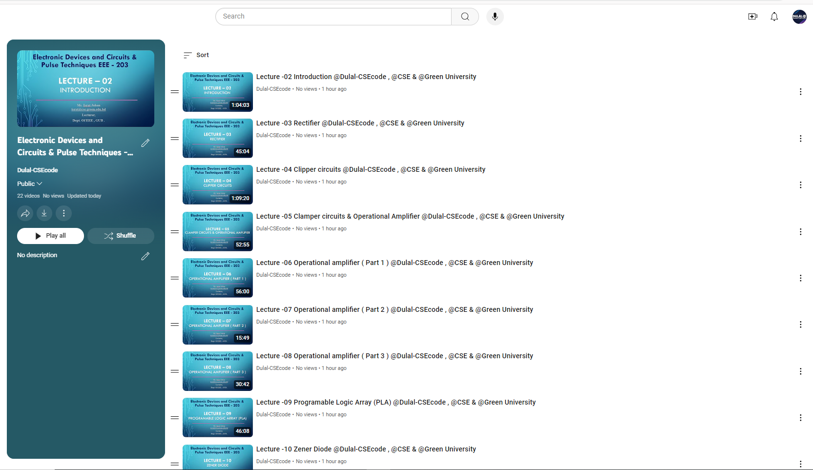

<h1 align="center">--- Electronic-Devices-and-Circuits-Pulse-Techniques---EEE-203 ---</h1>  
<h3 align="center">-- Spring 2024 --</h3>  
<br />  
Welcome to the Electronic Devices and Circuits (Pulse Techniques) EEE-203 repository. This repository contains course materials, assignments, and resources for the Electronic Devices and Circuits course.  
<br />  

  
  
<br />  

## Table of Contents
- [Introduction](#introduction)
- [Course Outline](#course-outline)
- [Installation](#installation)
- [Prerequisites](#prerequisites)
- [Assignments and Practice Problems](#assignments-and-practice-problems)
- [Usage](#usage)
- [Contributing](#contributing)
- [License](#license)

## Introduction

In this course, we will explore various topics related to electronic devices and pulse techniques, including diode circuit models, operational amplifiers (OP-AMPs), flip-flops, counters, memory systems, FETs, MOSFETs, BJTs, and more. This repository provides comprehensive materials and problem sets designed to help students grasp and apply these concepts.

Check out the playlist now and start your learning journey: [Electronic-Devices-and-Circuits-Pulse-Techniques---EEE-203 YouTube Playlist Link](https://youtube.com/playlist?list=PLEc-WcPXUsjuoqsICuVclwEfn9-THFJfP&si=Dah3nMCqftnC12Iz)  
**Happy Learning!**

## Course Outline

### 1. Introduction to the Course
- Overview of course objectives and structure.
  
### 2-4. Diode Circuit Models
- **Text:** 3.1, 3.3 (Text 1), 2.5 - 2.9 (Ref 2)
  - Related examples and problems from the book.
  - Diode Wave shaping (Clipping & Clamping), Diode logic gates.
  
### 5-6. Introduction to OP-AMPs
- **Text:** 2.1 - 2.5 (Text 2)
  - Related examples and problems from the book.
  - Non-linear applications of OP AMPs, Inverting and non-inverting Schmitt trigger circuits.

### 7-8. Flip-Flops, Counters, Registers, and Memory Systems
- **Text:** 5.3 – 5.5 (Text 3)
  - Propagation delay, product and noise immunity, solving mathematical problems.
  
### 9-10. Introduction to PLAs
- **Text:** 5.6, 5.7, 6.6.1, 6.6.2 (Text 3), 16.15 (Ref 1)
  - Logic Families: TTL, ECL, Monostable, Bistable, and Stable Multi-vibrators.
  
### 11-12. Analog Multiplier
- **Text:** 4.2 – 4.4 (Text 2)
  - Digital Filters, Pulse transformers, Pulse transmission, Pulse generation.
  
### 13-17. Introduction to FETs & MOSFETs
- **Text:** 4.1, 4.3, 4.10.3, 10.3 (Text 1)
  - Current voltage characteristics, CMOS technology, Logic circuit design with CMOS.
  
### 18-20. Bipolar Junction Transistors (BJTs)
- **Text:** 5.3.4, 5.4, 5.5 (Text 1)
  - BJT as a switch, LED, LCD, and optically coupled oscillators.

### 21-23. Timing Circuits
- **Text:** 9.8.1, 9.8.2, 9.9.2 (Text 1), 13.1-13.3, 13.5-1 (Text 2)
  - 555 Timer IC, Linear current sweeps, Open collector and high impedance gates.
  
### 24. Review of Topics
- Summary of topics covered before the final examination.

## Installation

To set up the environment:

1. Clone the repository:
   ```bash
   git clone https://github.com/Dulal-CSEcode/Electronic-Devices-and-Circuits-Pulse-Techniques---EEE-203.git
   cd Electronic-Devices-and-Circuits-Pulse-Techniques---EEE-203

2. Install any required packages or dependencies. For example, on a Debian-based system:

    ```bash
    sudo apt-get update
    sudo apt-get install build-essential
    ```
## Prerequisites

Before you begin, ensure you have met the following requirements:

- You have a basic understanding of programming concepts.
- You have access to a C/C++ compiler.
- You have a basic understanding of C/C++ programming.
- You have Git installed on your computer.

## Assignments and Practice Problems

This repository includes a collection of assignments and practice problems to help reinforce the concepts taught in the course. Each assignment is located in its respective directory with detailed instructions and resources.

## Usage
Navigate to the specific assignment or practice problem directory and follow the instructions provided in the README.md file located in each folder.

## Contributing
Contributions are welcome! To contribute, please follow these steps:

1. Fork the repository.

2. Create a new branch (e.g., feature-branch).

3. Make your changes and commit them (git commit -m 'Add new feature').

4. Push to the branch (git push origin feature-branch).

5. Create a pull request.

Please ensure your code follows the repository's coding standards and includes appropriate tests.

## License
This project is licensed under the MIT License. See the LICENSE file for more details.


<br/>
<h2 align="center"> Thanks for visiting the Financial-and-Managerial-Accounting-GED-401 repository.</h2>
<h3 align="center">© All rights reserved by Dulal-CSEcode @2024 © Department of Computer Science and Engineering, GUB </h3>
